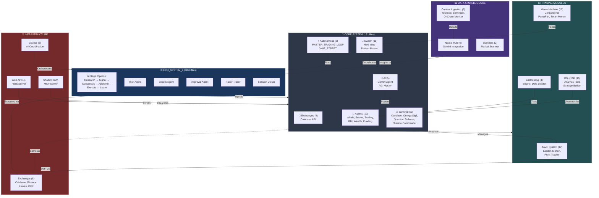

# COMPLETE SYSTEM ARCHITECTURE
**Location:** /Volumes/LegacySafe/SS_III/
**Generated:** 2025-12-13



## 📁 COMPLETE FOLDER STRUCTURE

```
/Volumes/LegacySafe/SS_III/
│
├── ECO_SYSTEM_4/                    [4,878 Python files]
│   ├── agents/execution/
│   ├── agents/research/
│   ├── blueprints/
│   └── main.py                      → ENTRY POINT
│
├── core/                            [151 Python files]
│   ├── agents/                      [12 trading agents]
│   ├── banking/                     [50 wealth modules]
│   │   ├── keyblade_engine.py
│   │   ├── omega_sigil_trading_analyzer.py
│   │   ├── quantum_defense_lattice.py
│   │   └── shadow_commander_engine.py
│   ├── autonomous/                  [8 loops]
│   │   ├── MASTER_TRADING_LOOP.py   → 24/7 ORCHESTRATOR
│   │   └── JANE_STREET_DEPLOYMENT.py
│   ├── swarm/                       [11 swarm agents]
│   ├── ai/                          [5 AI modules]
│   │   ├── gemini.py
│   │   └── sovereign_shadow_agi_master.py
│   ├── scanners/
│   ├── rebalancing/
│   └── exchanges/
│
├── AAVE_system/                     [12 DeFi modules]
│   ├── unified_ladder_system.py
│   ├── cold_storage_siphon.py
│   ├── profit_tracker.py
│   └── aave_monitor.py
│
├── meme_machine/                    [12 token scanners]
│   ├── scanner.py
│   ├── clients/
│   │   ├── dexscreener.py
│   │   ├── pumpfun.py
│   │   └── birdeye.py
│   └── smart_money.py
│
├── ds_star/                         [15 analysis tools]
│   ├── SynopticCore
│   ├── OracleInterface
│   └── ArchitectForge
│
├── agents/                          [15 specialized agents]
│   ├── transaction_monitor.py
│   ├── psychology_tracker.py
│   └── whale_scanner.py
│
├── neural_hub/                      [6 AI modules]
│   └── backend/gemini_agent.py
│
├── exchanges/                       [8 connectors]
│   ├── coinbase_connector.py
│   ├── binance.py
│   ├── kraken.py
│   └── okx.py
│
├── web_api/                         [4 API modules]
│   ├── app.py                       → Flask Server
│   ├── gio_api.py
│   └── portfolio_api.py
│
├── shadow_sdk/                      [MCP Server]
│   └── mcp_server.py
│
├── backtesting/                     [3 testing modules]
│   └── backtest_engine.py
│
└── content_ingestion/               [3 data modules]
    ├── youtube_transcriptor.py
    ├── sentiment_scanner.py
    └── onchain_monitor.py
```

## 🔑 KEY ENTRY POINTS

1. **ECO_SYSTEM_4/main.py** - Autonomous trading ecosystem (runs every 15 min)
2. **core/autonomous/MASTER_TRADING_LOOP.py** - 24/7 trading orchestrator
3. **core/autonomous/JANE_STREET_DEPLOYMENT.py** - HFT-style execution
4. **web_api/app.py** - Flask API server
5. **shadow_sdk/mcp_server.py** - Claude MCP integration

## 💾 CREDENTIALS

- **Location:** `ECO_SYSTEM_4/.env`
- **Contains:** Coinbase, Binance, Kraken, OKX API keys

## 📊 TOTAL COUNT

- **Total Systems:** 39
- **Total Python Files:** 10,036
- **Total Files:** ~15,000
- **Autonomous Loops:** 8
- **Trading Agents:** 27
- **Banking Modules:** 50
- **Exchange Connectors:** 8

---

**To render this as an image:**
1. Copy the Mermaid code to https://mermaid.live
2. Or use Obsidian, Notion, GitHub markdown
3. Or screenshot this visualization
