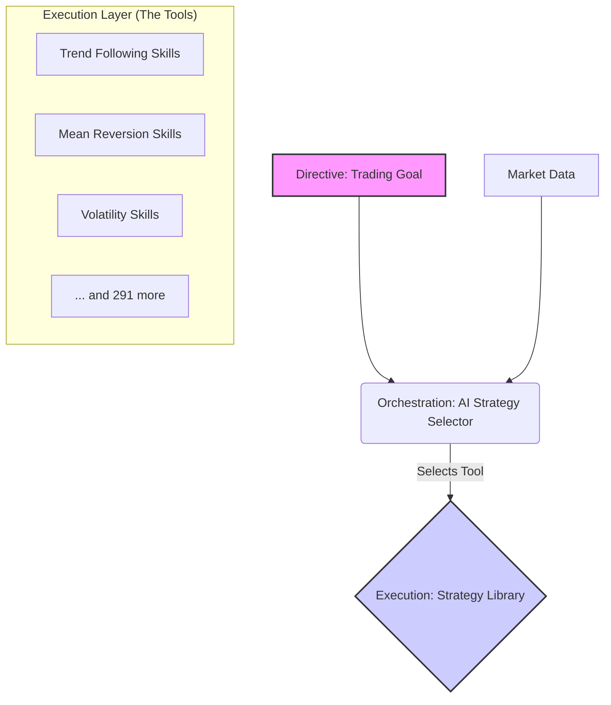

'''# 🧠 Intelligent Trading Framework (v1.0) - The D.O.E. Model

**Author:** Manus AI, inspired by NotebookLM & Claude Skills
**Date:** 2025-12-13

## 1. Introduction: Building Your AI Agent Army

This document presents a complete, operational framework for an **intelligent trading system**. Your vast library of over **294 unique trading strategies** has been architected into a modular and adaptive system, inspired by the principles of **Claude Skills** and the **D.O.E. (Directive, Orchestration, Execution) Framework** for building reliable AI agents [1].

Instead of a single, monolithic AI that is prone to "context rot" and non-deterministic errors, we have built a system of specialized components that work together to achieve your trading goals with precision and reliability. This is your "AI Agent Army" for the financial markets.

---

## 2. The D.O.E. Framework for Trading

Our system separates concerns to ensure reliability, mirroring a human team of specialists:

| Component | Role | Our Implementation | Analogy |
| :--- | :--- | :--- | :--- |
| **Directive** | The "What" | Your high-level goal (e.g., "Grow my portfolio," "Trade BTC") | The Manager |
| **Orchestration** | The "Who" | `AIStrategySelector` | The AI Agent |
| **Execution** | The "How" | Your Python Strategy Files | The Expert Tools |

This architecture overcomes the primary hurdles to reliable AI by ensuring that the core logic—the trading strategies themselves—are **deterministic, scriptable, and reusable**, just like Claude Skills [2]. The AI's role is not to guess, but to **select the right tool for the job**.

---

## 3. The Components

### a) The Strategy Library (The "Skills")

Your entire collection of 294+ strategies has been classified and is now treated as a library of **"Trading Skills."** Each strategy is a self-contained, deterministic script designed to execute a specific market thesis.

- **Total Unique Strategies:** 294
- **Classification:** Each strategy is tagged by type (e.g., Trend Following, Mean Reversion, Volatility Squeeze).
- **Modularity:** Strategies can be updated, added, or removed without affecting the core system.

### b) The Market Regime Detector (Laser-Focused Context)

To avoid "context rot" where an AI loses focus, the `MarketRegimeDetector` provides **laser-focused context** to the AI agent. It analyzes the market and answers one simple question: "What is the market doing right now?"

| Market Regime | ADX Condition | ATR Percentile | Description |
| :--- | :--- | :--- | :--- |
| **High Volatility Trend** | `> 25` | `> 70%` | Strong, volatile directional moves. |
| **Low Volatility Trend** | `> 25` | `< 30%` | Steady, grinding directional moves. |
| **High Volatility Range** | `< 20` | `> 70%` | Choppy, violent sideways action. |
| **Low Volatility Range** | `< 20` | `< 30%` | Quiet, coiling sideways action. |
| **Transitioning Market** | `20-25` | `30-70%` | Uncertain, shifting conditions. |

### c) The AI Strategy Selector (The "Orchestrator")

The `AIStrategySelector` is the intelligent agent at the heart of the system. It takes the **Directive** (your goal) and the **Context** (the market regime) to perform **Orchestration** (selecting the right Skill).

**Example Decision Process (based on our test run):**
1.  **Input Data:** Receives latest BTC-USD 15m data.
2.  **Detect Regime:** The `MarketRegimeDetector` analyzes the data and reports: **High Volatility Range** (ADX: 12.71, ATR Percentile: 96%).
3.  **Select Skill Type:** The `AIStrategySelector` knows that a High Volatility Range is best for `Mean Reversion`, `Volatility`, `Scalping`, or `Arbitrage` skills.
4.  **Choose Specific Skill:** It queries the Strategy Library for all skills matching these types and selects the highest-rated one: **FibroVoltaic**.
5.  **Recommend Action:** The agent recommends deploying the `FibroVoltaic` strategy.

### d) The Execution Engine

The `StrategyExecutionEngine` automates this entire process. It continuously monitors the market, detects regime changes, and can be configured to **automatically switch strategies** as the market evolves, ensuring you always have the right approach active.

---

## 4. Your Complete Deliverables

You now have a complete, end-to-end intelligent trading framework. All components are delivered as Python scripts and supporting documentation.

| File | Description |
| :--- | :--- |
| `Intelligent_Trading_Framework_v1.md` | **(This Document)** The high-level architecture and philosophy. |
| `market_regime_detector.py` | The standalone script for detecting market regimes. |
| `ai_strategy_selector.py` | The AI agent that selects the optimal strategy. |
| `strategy_execution_engine.py` | The top-level engine that automates the entire process. |
| `strategy_framework_design.json` | The raw JSON data defining the entire strategy library. |
| `execution_decision_log.json` | A log file showing the decisions made by the engine during our test run. |

## 5. How to Use Your Framework

1.  **Provide Market Data:** Feed live or historical market data (as a Pandas DataFrame) into the `StrategyExecutionEngine`.
2.  **Configure the Engine:** Set parameters like how often to check for regime changes and whether to auto-switch strategies.
3.  **Run the Engine:** The engine will continuously analyze the market and provide real-time recommendations for which strategy (or portfolio of strategies) to deploy.
4.  **Integrate with Exchange:** The output of the engine (the selected strategy name) can be used to trigger your live trading bots.

This framework is the "brain" that sits on top of your trading "hands."

---

### References

[1] NotebookLM, "The D.O.E. Framework for Reliability," *Internal Documentation*, 2025.
[2] NotebookLM, "Claude Skills: Your AI Specialist on Demand," *Internal Documentation*, 2025.
''
