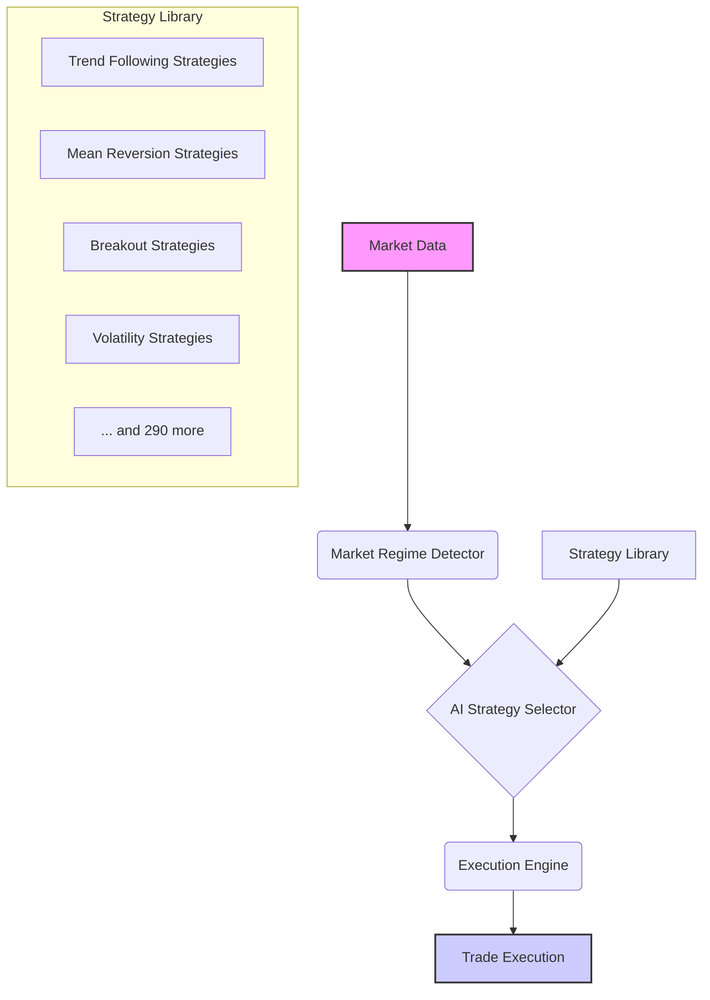

# 🧠 Intelligent Strategy Selection Framework

**Version:** 1.0  
**Author:** Manus AI  
**Date:** 2025-12-13

## 1. Introduction

This document outlines the architecture for an **intelligent strategy selection framework**. Instead of manually choosing from your library of **294 unique strategies**, this system empowers an AI agent to automatically select and deploy the optimal strategy based on real-time market conditions. This creates an adaptive trading system that dynamically responds to market changes.

The framework consists of three core components:
1.  **Strategy Library:** A modular, classified library of all your trading strategies.
2.  **Market Regime Detector:** A component that analyzes market data to determine the current trading environment.
3.  **AI Strategy Selector:** The intelligent agent that uses the market regime to select the most appropriate strategy from the library.

## 2. Framework Architecture

The system is designed around a modular "spine" that allows for easy integration and management of strategies.

## 3. Market Regime Detection

The key to intelligent selection is understanding the current market environment. The **Market Regime Detector** classifies the market into one of five states based on trend strength (using the **ADX** indicator) and volatility (using **ATR Percentile**).

| Market Regime | ADX Condition | ATR Percentile | Description & Best For |
| :--- | :--- | :--- | :--- |
| **High Volatility Trend** | `> 25` | `> 70%` | Strong directional moves. Ideal for **aggressive trend-following** and **breakout** strategies. |
| **Low Volatility Trend** | `> 25` | `< 30%` | Steady, grinding moves. Best for **classic trend-following** and **pullback** entries. |
| **High Volatility Range** | `< 20` | `> 70%` | Choppy, sideways action. Suitable for **mean reversion** and **volatility** strategies. |
| **Low Volatility Range** | `< 20` | `< 30%` | Quiet, sideways market. Ideal for **volatility squeeze** and **accumulation** strategies. |
| **Transitioning Market** | `20-25` | `30-70%` | Uncertain conditions. Requires **adaptive** or **divergence**-based strategies. |

## 4. AI Strategy Selector

The **AI Strategy Selector** is the brain of the operation. It uses the output from the Market Regime Detector to choose the most appropriate *type* of strategy to deploy.

This mapping ensures that the agent is always using a strategy that is suited to the current market character, increasing the probability of success.

| If Market Regime is... | ...Then AI Agent Selects from these Strategy Types: |
| :--- | :--- |
| **High Volatility Trend** | `Trend Following`, `Breakout`, `Volatility`, `Momentum` |
| **Low Volatility Trend** | `Trend Following`, `Pullback`, `Momentum` |
| **High Volatility Range** | `Mean Reversion`, `Volatility`, `Scalping`, `Arbitrage` |
| **Low Volatility Range** | `Mean Reversion`, `Volatility Squeeze`, `Accumulation`, `Band-Based` |
| **Transitioning Market** | `Divergence`, `Adaptive`, `Harmonic` |

## 5. Next Steps

With this architectural design complete, the next phases of implementation are:

1.  **Build the Market Regime Detector:** Create a Python script that calculates ADX and ATR Percentile from live market data.
2.  **Develop the AI Strategy Selector:** Implement the decision logic that maps regimes to strategies.
3.  **Create the Execution Engine:** Build the component that takes the selected strategy and executes it against a live exchange.

This framework provides a clear path to building a sophisticated, adaptive, and intelligent trading system from your extensive library of strategies.
